## Introduction

With climate change effects on the rise, it is of great importance to be aware of any new challenges and know how to handle them. One of the consequences that have resulted is an increasing amount of fires globally. An analysis felt warranted using fire occurrences found in the US, narrowed down to Colorado to determine what insights can be made with the data that's been gathered so far. 

## Questions

After pulling the data, some questions naturally arose:
* Which district had the most fires?
* Which districts had the longest burning fires?
* What months have a higher chance of a fire occuring?

Using data analysis techniques in QGIS and python, we are able to see the results in an attempt to answer these questions.

## Assumptions

* Although the data pulled from the [FS data archive](https://www.fs.usda.gov/rds/archive/Catalog/RDS-2013-0009.5) contains all of the fires that have occured within the US, this analysis will only be performed for the state of Colorado.
* Due to having such a large timespan recorded for that dataset, for brevity the date range that will be looked at is between January 2012-January 2019.

## Vector

Looking into the [data.colorado.gov](data.colorado.gov) website, there seems to be several districts available to choose from. The two that stood out while navigating the data catalog were these:

<center>
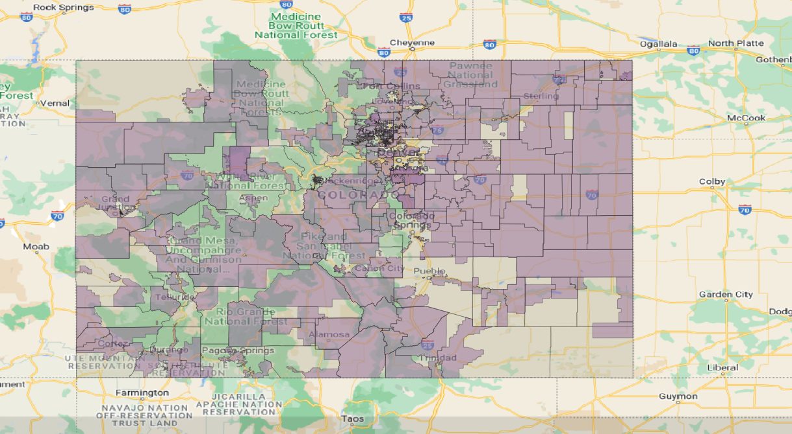
</center>
<center>
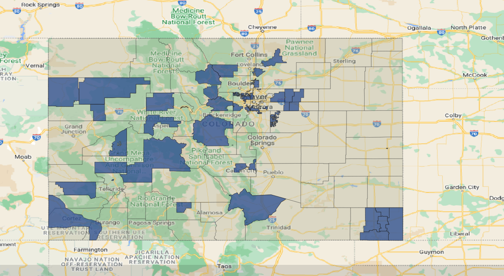
</center>
To test out the capabilities of the QGIS interface, an intersection of the two layers was performed. 

<center>
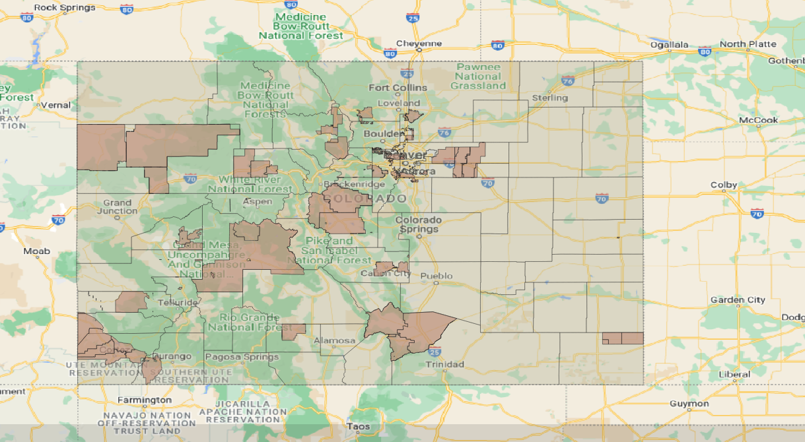
</center>

This looks mostly the same as the Parks and Rec layer as expected, save a couple of areas. This is because the fire district seems to span quite a larger area of the state, and the fact that logically it makes sense that the fire district overlaps the Parks and Rec district quite a bit.  What is neat is that we can take the same intersection and only find the fires that fall within this layer.

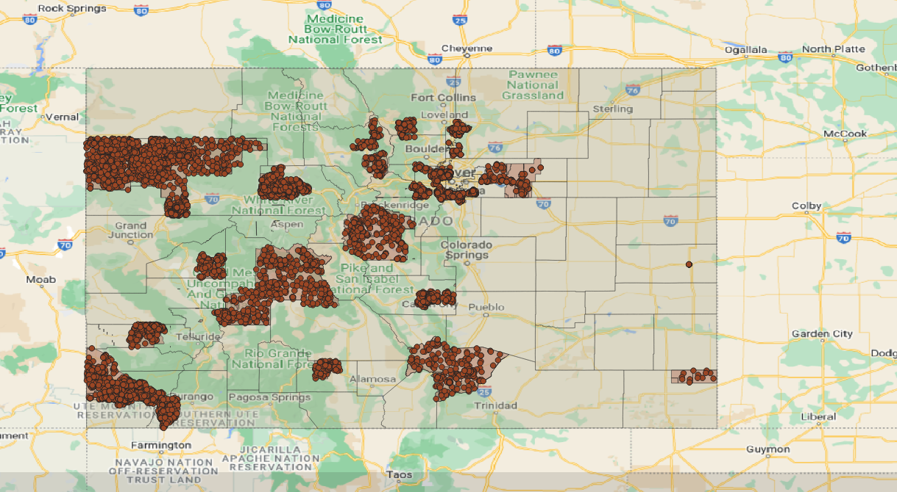

The fire occurences data happened to contain an attribute table, which has an occurence date as a column. Using this, the temporal feature within QGIS generated slides, which a gif could be created. The result:


## Statistical Methods

A further analysis was needed, and unfortunately QGIS, although a python console exists within, has its limitations. Instead, a Jupyter Notebook was created that uses python, geopandas and matplotlib. After loading the fire occurences that intersected with the intersection of the districts, a new column was created calculating the difference between the day that the fire was discovered and the day that it was contained.

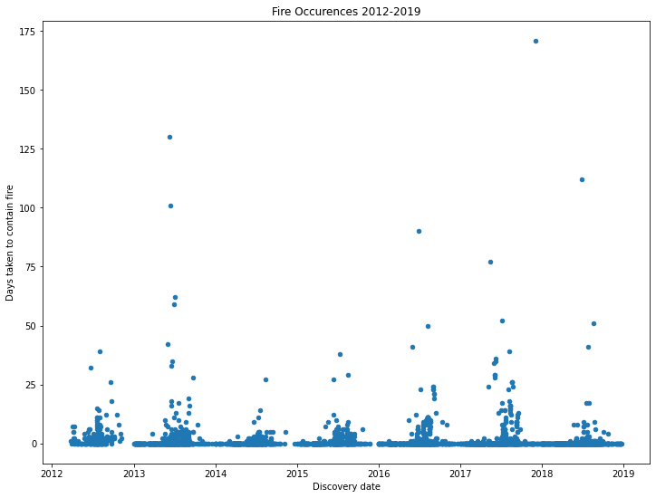

Looking at the output, there seems to have a seasonal trend. Because this is a time series dataset, we can add color to it and find out in which months the fires take the longest to contain.

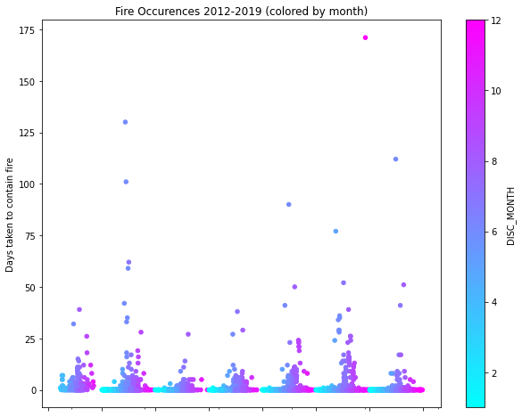

Some more information can be seen in this plot. As expected, the higher containment days fall somewhere between 4 and 7 i.e. April and July. What stands out the most though is the outlier in the data; this happened to start in December and it took 171 of 365 days to contain (meaning that it lasted almost 6 months).

An attempt was made to fit the data to a linear regression model using a package found in  `statsmodels.formula.api` 

```

"""
                            OLS Regression Results                            
==============================================================================
Dep. Variable:              DATE_DIFF   R-squared:                       0.012
Model:                            OLS   Adj. R-squared:                  0.011
Method:                 Least Squares   F-statistic:                     45.03
Date:                Tue, 12 Jul 2022   Prob (F-statistic):           2.23e-11
Time:                        10:10:53   Log-Likelihood:                -12404.
No. Observations:                3855   AIC:                         2.481e+04
Df Residuals:                    3853   BIC:                         2.482e+04
Df Model:                           1                                         
Covariance Type:            nonrobust                                         
==============================================================================
                 coef    std err          t      P>|t|      [0.025      0.975]
------------------------------------------------------------------------------
Intercept     -0.4784      0.264     -1.811      0.070      -0.996       0.040
DISC_MONTH     0.2739      0.041      6.710      0.000       0.194       0.354
==============================================================================
Omnibus:                     7281.969   Durbin-Watson:                   1.666
Prob(Omnibus):                  0.000   Jarque-Bera (JB):         13427949.470
Skew:                          14.286   Prob(JB):                         0.00
Kurtosis:                     290.718   Cond. No.                         17.9
==============================================================================

Notes:
[1] Standard Errors assume that the covariance matrix of the errors is correctly specified.
"""
```

The R squared and adjusted R squared values are very low, which indicates that this would be an extremely poor model to use for any sort of analysis. This is confirmed by looking at the residuals, where no heteroscadisticity is apparent.

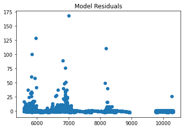


Some options for fixing this given that this is a time series:

* To attempt to create white noise out of the residuals, an order of integration will most likely need to be determined. First check to see if there exists a unit root in the data, which can be done using the Augmented Dickey-Fuller test. If there is one, then take a difference  to get order 1, plot the residuals again and do the ADF test again. It could be the case that it would need a 2nd difference but it's possible it does not. From there AR and MA models can be determined using other analyses such as acf/pacf/eacf plots.
* A simpler way would be to use  `auto_arima`  found in the  `pmdarima`  package. This would do the job if accuracy is not very important, but the statistical reasoning for why the ARIMA model was chosen is not there.

## Location of Fires

Even though there was difficulty in doing any sort of statistical analysis, we can still see the areas in which the fires occured. From there, we can filter by the intersections of the fire district with several other districts: Parks and Rec, Water and Sanitation, and Soil. Below is all the fires that have occured in the state in the given time frame:

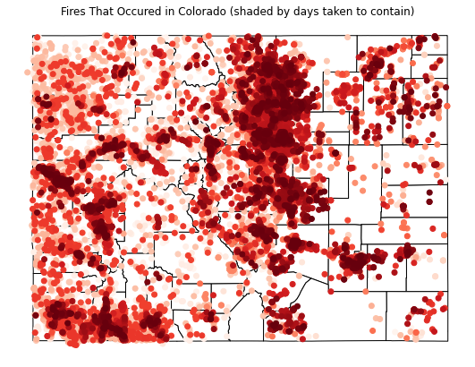

Of these fires, we only want to look at the ones that happened in the fire district. 

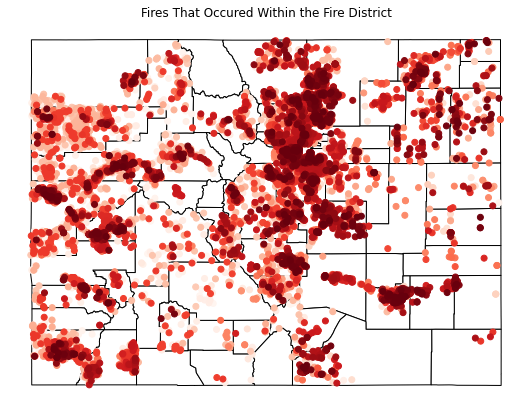

Intersecting the district layers with the fires gives more insight on whether the fires are overlapping with other districts and how severe those districts are are in terms of containing them.

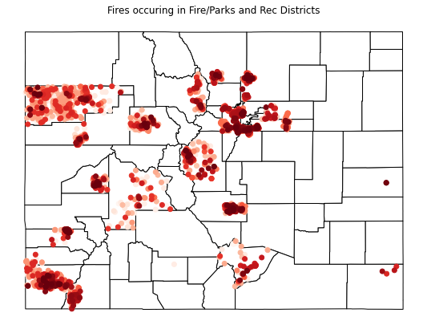

Looking at the map, we see that there seems to be a heavier concentration within the Denver county area, with some of the longest lasting fires found in El Paso, Mesa, Montezuma and Denver counties.

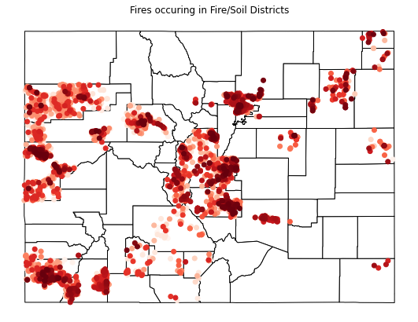

Compared to the previous plot, the soil district is not as bad in terms of how long the fires lasted, although there is a lot more spread due to the size of the district in general.

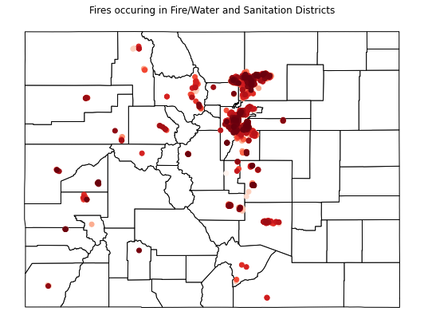

Out of all the districts, the water district has less fires in total. Unfortunately, most of the fires that did occur happened to last longer if it did occur.

## Conclusion

After all of the analysis was performed, the questions can now be answered. For frequency, the fire district is the one with the highest volume of fire occurences overall. Overlapping the other districts with the fire district, we found that out of the other three districts, Parks and Rec had the higher amount of fires, although the water district has a higher volume of longer burning fires. With some outliers, for the most part a large amount of fires happen within April and July.